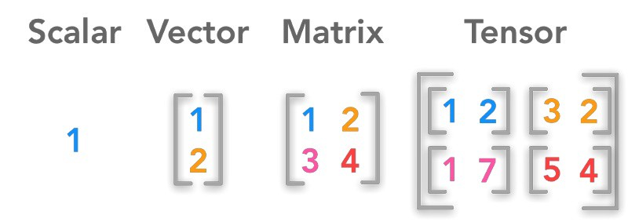

# Tensorflow

## 1. What is Tensorflow
- 딥러닝 프로그램을 쉽게 구현 할 수 있도록 기능을 제공하는 구글에서 만든 라이브러리다.
- 구현은 c++로 되어 있으나, python, java등 다양한 언어를 지원한다. 
- Tensor 라고 불리는 데이터를 Computational Graph를 통해 흘려가면서 복잡한 행렬 연산을 수행한다.

## 2. What is Tensor
- 텐서는 하나의 배열(데이터)을 의미한다.
- 텐서는 Rank, Shape, Type 세가지의 특징을 갖는다. 
```python
tensor = [
[1, 2],
[2, 3],
[3, 4]
]
```
- Rank는 배열의 차원이다. 위 예제에서 Rank는 2다.
- Shape는 배열의 모양이다. 위 예제에서 Shape는 3 * 2다.
- Type는 텐서 값의 타입이다. 주로 float.32를 사용하며 위 예제는 int다. 

## 3. Tensor data srtucture



- rank-0 tensor: Scalar - 정수나 실수와 같은 constant number
- rank-1 tensor: Vector - 여러 개의 scalar 값을 원소로 갖는 1차원 배열
- rank-2 tensor: Matrix - 여러 개의 1차원 벡터를 원소로 갖는 1차원 배열
- rank-n tensor: rank-(n-1) tensor를 원소로 갖는 1차원 배열


